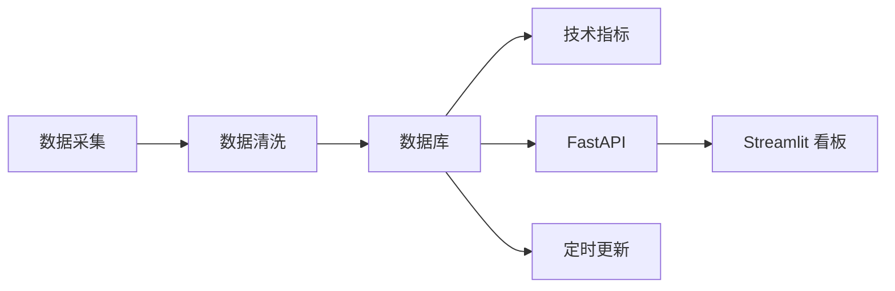

# A 股行情数据平台

> A-share Stock Market Historical Data Platform — MVP v0.1.0

沪深京全量股票日线行情、技术指标、RESTful API、可视化看板、Docker 部署。

## 项目概览

覆盖从数据采集、清洗、入库、分析，到 API 服务、可视化展示、定时更新和容器化部署的全流程。



### 功能特性

| 模块 | 说明 |
|------|------|
| **数据采集** | 爬取 A 股全量股票信息及历史日线行情，支持前/后/不复权 |
| **技术指标** | 自动计算 MA、MACD、RSI、Bollinger Bands |
| **RESTful API** | 股票搜索、详情、历史行情、技术指标、涨跌幅/成交量排行、CSV 导出 |
| **可视化看板** | 基于 Streamlit 的交互式 K 线图、成交量图、MACD 图、多股对比 |
| **定时任务** | 日频增量更新行情、月频刷新股票列表、周频重算指标 |
| **数据质量** | 空值/重复/异常值检查、交易日缺口检测、质量报告 |
| **容器部署** | Docker Compose 一键启动 MySQL + API + Dashboard + Scheduler |

## 技术栈

| 层 | 技术 |
|---|------|
| 语言 | Python >= 3.10 |
| 框架 | FastAPI, Streamlit |
| ORM | SQLAlchemy + Alembic |
| 数据库 | MySQL 8.0 |
| 数据处理 | pandas, numpy |
| 图表 | Plotly |
| 任务调度 | APScheduler |
| 部署 | Docker, Docker Compose |

## 快速开始

### 前置条件

- Python >= 3.10
- MySQL 8.0（或 Docker）
- pip

### 本地开发

```bash
# 1. 克隆项目
git clone https://github.com/py7xiaopai/case2.git
cd case2

# 2. 创建虚拟环境
python3 -m venv .venv
source .venv/bin/activate

# 3. 安装依赖
python3 -m pip install -U pip
python3 -m pip install -e .

# 4. 配置环境变量
cp .env.example .env
# 编辑 .env 中的数据库连接信息

# 5. 创建数据库
mysql -u root -p -e "CREATE DATABASE IF NOT EXISTS stock_market CHARACTER SET utf8mb4 COLLATE utf8mb4_unicode_ci;"

# 6. 数据库迁移
export PYTHONPATH=src
alembic revision --autogenerate -m "init tables"
alembic upgrade head

# 7. 初始化数据
python3 scripts/seed_trading_calendar.py             # 交易日历
python3 -c "from stock_platform.crawler.stock_list import crawl_stock_list; from stock_platform.db.engine import SessionLocal; s=SessionLocal(); print(crawl_stock_list(s)); s.close()"  # 股票列表
python3 -c "from stock_platform.crawler.daily_price import crawl_all_stocks_daily_prices; from stock_platform.db.engine import SessionLocal; s=SessionLocal(); print(crawl_all_stocks_daily_prices(s)); s.close()"  # 历史行情
python3 -c "from stock_platform.data.indicators import calculate_all_indicators; from stock_platform.db.engine import SessionLocal; s=SessionLocal(); print(calculate_all_indicators(s)); s.close()"  # 技术指标
```

### 启动服务

```bash
# API 服务 (端口 8000)
export PYTHONPATH=src
uvicorn stock_platform.api.main:app --host 0.0.0.0 --port 8000 --reload

# 可视化看板 (端口 8501)
streamlit run src/stock_platform/dashboard/app.py --server.port 8501 --server.address 0.0.0.0

# 定时调度器
python3 -m stock_platform.scheduler.tasks
```

### Docker 部署

```bash
docker compose up -d --build
```

服务启动后：

| 服务 | 地址 |
|------|------|
| API 文档 | http://localhost:8000/docs |
| ReDoc | http://localhost:8000/redoc |
| Dashboard | http://localhost:8501 |

### 运行测试

```bash
PYTHONPATH=src pytest -v
```

## API 接口

| 方法 | 路径 | 说明 |
|------|------|------|
| GET | `/` | 服务状态 |
| GET | `/health` | 健康检查 |
| GET | `/stocks/search` | 股票搜索（代码/名称/市场） |
| GET | `/stocks/{code}` | 股票详情 |
| GET | `/stocks/{code}/prices` | 历史行情 |
| GET | `/stocks/{code}/indicators` | 技术指标（MA, MACD, RSI, Bollinger） |
| GET | `/stocks/{code}/export` | 导出行情 CSV |
| GET | `/rankings/changes` | 涨跌幅排行 |
| GET | `/rankings/volume` | 成交量排行 |
| GET | `/quality` | 数据质量报告 |

## 项目结构

```
stock-market-platform/
├── pyproject.toml           # 项目配置与依赖
├── Dockerfile               # Docker 构建
├── docker-compose.yml       # 容器编排
├── alembic.ini              # 数据库迁移配置
├── alembic/                 # 迁移脚本
│   └── versions/
├── src/
│   └── stock_platform/
│       ├── api/             # FastAPI 接口
│       ├── crawler/         # 数据爬虫
│       ├── data/            # 数据处理 & 指标计算
│       ├── db/              # 数据库模型 & 引擎
│       ├── dashboard/       # Streamlit 可视化
│       └── scheduler/       # 定时任务
├── scripts/                 # 运维脚本
└── tests/                   # 单元测试
```

## 开发计划

参见 [REPORT.md](REPORT.md) 了解详细开发记录和后续规划。
